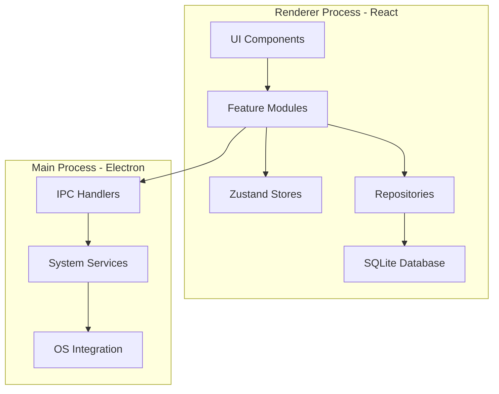

# MyFlow - Technical Architecture Document

**Version:** 1.0  
**Date:** June 11, 2026  
**Status:** Architecture Planning Phase

---

## Table of Contents

1. [Executive Summary](#executive-summary)
2. [Technology Stack](#technology-stack)
3. [Project Structure](#project-structure)
4. [Module Architecture](#module-architecture)
5. [Data Models](#data-models)
6. [Implementation Phases](#implementation-phases)
7. [Key Technical Decisions](#key-technical-decisions)
8. [Security & Performance](#security--performance)
9. [Testing Strategy](#testing-strategy)
10. [Deployment & Distribution](#deployment--distribution)

---

## Executive Summary

MyFlow is a Windows desktop productivity application built with Electron, React, and TypeScript. The application focuses on workspace automation, time management, task organization, and productivity tracking. It operates as a local-first application with persistent data storage and system-level integrations.

**Core Principles:**
- Local-first architecture (no internet dependency)
- Clean, modular codebase
- Excellent UX with minimal friction
- Scalable foundation for future features
- Windows-optimized with cross-platform potential

---

## Technology Stack

### 1. Desktop Framework: **Electron**

**Rationale:**
- Native Windows integration (system startup, notifications, tray)
- Mature ecosystem with extensive documentation
- Cross-platform potential for future expansion
- Access to Node.js APIs for system operations
- Large community and proven track record

**Version:** Electron 28+ (latest stable)

### 2. Frontend Framework: **React 18+ with TypeScript**

**Rationale:**
- Component-based architecture promotes reusability
- TypeScript provides type safety and better developer experience
- Large ecosystem of libraries and tools
- Excellent performance with React 18 features (concurrent rendering)
- Strong community support

### 3. UI Framework: **Tailwind CSS + shadcn/ui**

**Rationale:**
- **Tailwind CSS:** Utility-first approach for rapid development and consistency
- **shadcn/ui:** High-quality, accessible React components built on Radix UI
- Better than Material UI for this use case:
  - More customizable and lightweight
  - Modern design system
  - Better performance (tree-shakeable)
  - Easier to create unique brand identity
- Supports dark/light themes out of the box

### 4. State Management: **Zustand**

**Rationale:**
- Simpler than Redux with less boilerplate
- Better performance than Context API for complex state
- Small bundle size (~1KB)
- TypeScript-first design
- Easy to learn and maintain
- Perfect for medium-complexity applications

**Alternative considered:** Redux Toolkit (too heavy for this use case)

### 5. Database: **SQLite with better-sqlite3**

**Rationale:**
- **SQLite over JSON:**
  - Better performance for queries and updates
  - ACID compliance (data integrity)
  - Efficient indexing for fast searches
  - Handles concurrent operations better
  - Built-in migration support
  - Scales better as data grows
- **better-sqlite3:** Synchronous API, faster than async alternatives
- Single file database (easy backup/restore)
- No server required (true local-first)

**Schema Management:** Kysely (type-safe query builder)

### 6. Charts Library: **Recharts**

**Rationale:**
- Built specifically for React
- Declarative API (React-like)
- Good documentation and examples
- Supports all needed chart types (line, bar, pie)
- Responsive and customizable
- Better than Chart.js for React applications

### 7. Notification System: **Electron Native + node-notifier**

**Rationale:**
- Uses Windows native notification system
- Consistent with OS experience
- Supports actions and custom sounds
- Low resource usage
- Reliable delivery

### 8. Additional Key Libraries

| Purpose | Library | Rationale |
|---------|---------|-----------|
| Date/Time | date-fns | Lightweight, tree-shakeable, immutable |
| Forms | React Hook Form | Performance, minimal re-renders |
| Validation | Zod | TypeScript-first, runtime validation |
| i18n | i18next + react-i18next | Industry standard, flexible |
| Icons | Lucide React | Modern, consistent, tree-shakeable |
| Drag & Drop | dnd-kit | Modern, accessible, performant |
| Process Management | child_process (Node.js) | Native, reliable for launching apps |

---

## Project Structure

```
myflow/
├── electron/                      # Electron main process
│   ├── main.ts                   # Entry point
│   ├── preload.ts                # Preload script (IPC bridge)
│   ├── services/                 # Main process services
│   │   ├── AppLauncher.ts       # Launch apps/URLs
│   │   ├── SystemIntegration.ts # Windows startup, tray
│   │   ├── NotificationService.ts
│   │   └── AutomationEngine.ts  # Execute automations
│   ├── ipc/                      # IPC handlers
│   │   ├── workspace.handlers.ts
│   │   ├── system.handlers.ts
│   │   └── notification.handlers.ts
│   └── utils/                    # Main process utilities
│
├── src/                          # React renderer process
│   ├── main.tsx                 # React entry point
│   ├── App.tsx                  # Root component
│   │
│   ├── components/              # Reusable components
│   │   ├── ui/                 # shadcn/ui components
│   │   ├── layout/             # Layout components
│   │   │   ├── Sidebar.tsx
│   │   │   ├── Header.tsx
│   │   │   └── MainLayout.tsx
│   │   └── shared/             # Shared components
│   │       ├── Card.tsx
│   │       ├── Modal.tsx
│   │       └── ConfirmDialog.tsx
│   │
│   ├── features/               # Feature modules
│   │   ├── dashboard/
│   │   │   ├── components/
│   │   │   ├── hooks/
│   │   │   ├── store/
│   │   │   └── Dashboard.tsx
│   │   ├── launcher/
│   │   ├── clock-pomodoro/
│   │   ├── tasks/
│   │   ├── reminders/
│   │   ├── notes/
│   │   ├── automations/
│   │   └── settings/
│   │
│   ├── services/               # Renderer services
│   │   ├── database/
│   │   │   ├── client.ts      # Database connection
│   │   │   ├── migrations/    # Schema migrations
│   │   │   └── repositories/  # Data access layer
│   │   ├── ipc/               # IPC client wrappers
│   │   └── analytics/
│   │
│   ├── hooks/                 # Global hooks
│   ├── store/                 # Global Zustand stores
│   ├── types/                 # TypeScript types
│   ├── utils/                 # Utility functions
│   ├── i18n/                  # Internationalization
│   └── styles/                # Global styles
│
├── public/                    # Static assets
├── database/                  # Database files (gitignored)
├── scripts/                   # Build and utility scripts
├── tests/                     # Test files
└── docs/                      # Documentation
```

### Architecture Layers



---

## Module Architecture

### 1. Dashboard Module

**Purpose:** Display productivity metrics and daily overview

**Components:**
- `DashboardCard` - Metric display card
- `ProductivityChart` - Visual charts
- `DailyOverview` - Today's summary
- `WeeklyView` - Week comparison

**Data Sources:**
- Pomodoro sessions from `PomodoroRepository`
- Task completion from `TaskRepository`
- Work time from `MetricsRepository`

**Store:** `useDashboardStore`

**Key Metrics:**
- Total work time today
- Pomodoros completed
- Tasks completed vs total
- Focus score (calculated)
- Weekly comparison

---

### 2. Launcher/Workspace Module

**Purpose:** Launch applications and URLs, manage workspaces

**Components:**
- `WorkspaceList` - Display workspaces
- `WorkspaceCard` - Individual workspace
- `WorkspaceEditor` - Create/edit workspace
- `ActionList` - Workspace actions
- `LaunchButton` - Execute workspace

**IPC Communication:**
- `workspace:launch` - Execute workspace
- `workspace:validate` - Check app paths
- `app:checkRunning` - Verify if app is running

**Store:** `useWorkspaceStore`

**Main Process Service:** `AppLauncher`

---

### 3. Clock & Pomodoro Module

**Purpose:** World clock, alarms, and Pomodoro timer

**Components:**
- `WorldClock` - Multi-timezone display
- `PomodoroTimer` - Timer interface
- `AlarmManager` - Alarm list
- `AlarmForm` - Create/edit alarms
- `SessionHistory` - Past sessions

**Store:** `useClockPomodoroStore`

**Key Features:**
- Real-time clock updates (1s interval)
- Pomodoro state machine (focus → short break → long break)
- Alarm scheduling with notifications
- Session tracking and statistics

**Timezones:**
- America/Sao_Paulo (Brasília)
- Asia/Kolkata (India)
- America/Chicago (CST)
- Asia/Manila (Philippines)

---

### 4. Tasks Module

**Purpose:** Task management with Eisenhower matrix prioritization

**Components:**
- `EisenhowerMatrix` - 4-quadrant view
- `TaskList` - List view
- `TaskCard` - Individual task
- `TaskForm` - Create/edit task
- `SubtaskList` - Subtask management
- `TaskFilters` - Filter/sort controls

**Store:** `useTaskStore`

**Priority Quadrants:**
1. Urgent & Important (Do First)
2. Not Urgent & Important (Schedule)
3. Urgent & Not Important (Delegate)
4. Not Urgent & Not Important (Eliminate)

**Drag & Drop:** Using dnd-kit for moving tasks between quadrants

---

### 5. Reminders Module

**Purpose:** Smart reminders including health reminders

**Components:**
- `ReminderList` - All reminders
- `ReminderCard` - Individual reminder
- `ReminderForm` - Create/edit
- `HealthReminders` - Health presets

**Store:** `useReminderStore`

**Reminder Types:**
- Time-based (specific time)
- Interval-based (every X minutes)
- Recurring (daily, weekly)
- Context-based (future implementation)

**Health Reminders:**
- Drink water (60 min default)
- Stretch (90 min default)
- 20-20-20 rule for eyes (20 min default)
- Stand and walk (120 min default)

**Main Process Service:** `ReminderScheduler`

---

### 6. Notes Module

**Purpose:** Quick notes with markdown support

**Components:**
- `NoteList` - Grid/list view
- `NoteCard` - Note preview
- `NoteEditor` - Edit interface
- `NoteSearch` - Search functionality
- `CategoryFilter` - Filter by category

**Store:** `useNoteStore`

**Features:**
- Markdown rendering (using react-markdown)
- Pinned notes
- Categories/tags
- Full-text search
- Code syntax highlighting

---

### 7. Automations Module

**Purpose:** Advanced automation workflows

**Components:**
- `AutomationList` - All automations
- `AutomationEditor` - Visual editor
- `ActionBuilder` - Add actions
- `TriggerConfig` - Configure triggers
- `ExecutionLog` - Execution history

**Store:** `useAutomationStore`

**Action Types:**
- `open_app` - Launch application
- `open_url` - Open URL in browser
- `close_app` - Close application
- `wait` - Delay execution
- `notification` - Show notification
- `open_folder` - Open file explorer
- `run_script` - Execute script (future)

**Trigger Types:**
- Manual (button click)
- On startup
- Scheduled time
- Keyboard shortcut (future)

**Main Process Service:** `AutomationEngine`

---

### 8. Settings Module

**Purpose:** Application configuration

**Components:**
- `SettingsTabs` - Tab navigation
- `AppearanceSettings`
- `ClockSettings`
- `PomodoroSettings`
- `ReminderSettings`
- `AutomationSettings`
- `DashboardSettings`
- `TaskSettings`
- `AdvancedSettings`

**Store:** `useSettingsStore`

**Settings Categories:**
1. Appearance (theme, colors, fonts)
2. Clock & Timezones
3. Alarms & Pomodoro
4. Reminders
5. Automations
6. Dashboard
7. Tasks & Notes
8. Advanced (backup, logs, reset)

---

## Data Models

### Database Schema

```sql
-- Workspaces/Automations
CREATE TABLE workspaces (
    id TEXT PRIMARY KEY,
    name TEXT NOT NULL,
    icon TEXT,
    enabled INTEGER DEFAULT 1,
    actions TEXT NOT NULL, -- JSON array
    trigger_on_startup INTEGER DEFAULT 0,
    trigger_hotkey TEXT,
    trigger_scheduled_time TEXT,
    created_at TEXT NOT NULL,
    updated_at TEXT NOT NULL
);

-- Tasks
CREATE TABLE tasks (
    id TEXT PRIMARY KEY,
    title TEXT NOT NULL,
    description TEXT,
    priority TEXT NOT NULL,
    deadline TEXT,
    estimated_minutes INTEGER,
    tags TEXT, -- JSON array
    subtasks TEXT, -- JSON array
    completed INTEGER DEFAULT 0,
    completed_at TEXT,
    created_at TEXT NOT NULL,
    updated_at TEXT NOT NULL
);

CREATE INDEX idx_tasks_priority ON tasks(priority);
CREATE INDEX idx_tasks_completed ON tasks(completed);
CREATE INDEX idx_tasks_deadline ON tasks(deadline);

-- Notes
CREATE TABLE notes (
    id TEXT PRIMARY KEY,
    title TEXT NOT NULL,
    content TEXT NOT NULL,
    category TEXT,
    tags TEXT, -- JSON array
    pinned INTEGER DEFAULT 0,
    created_at TEXT NOT NULL,
    updated_at TEXT NOT NULL
);

CREATE INDEX idx_notes_pinned ON notes(pinned);
CREATE INDEX idx_notes_category ON notes(category);
CREATE VIRTUAL TABLE notes_fts USING fts5(title, content, content=notes);

-- Reminders
CREATE TABLE reminders (
    id TEXT PRIMARY KEY,
    type TEXT NOT NULL,
    title TEXT NOT NULL,
    enabled INTEGER DEFAULT 1,
    time TEXT,
    interval_minutes INTEGER,
    recurrence TEXT, -- JSON
    working_hours_only INTEGER DEFAULT 0,
    sound TEXT,
    last_triggered_at TEXT,
    created_at TEXT NOT NULL,
    updated_at TEXT NOT NULL
);

CREATE INDEX idx_reminders_enabled ON reminders(enabled);
CREATE INDEX idx_reminders_type ON reminders(type);

-- Alarms
CREATE TABLE alarms (
    id TEXT PRIMARY KEY,
    title TEXT NOT NULL,
    time TEXT NOT NULL,
    enabled INTEGER DEFAULT 1,
    recurring_days TEXT, -- JSON array
    sound TEXT,
    snooze_minutes INTEGER DEFAULT 5,
    created_at TEXT NOT NULL,
    updated_at TEXT NOT NULL
);

CREATE INDEX idx_alarms_enabled ON alarms(enabled);

-- Pomodoro Sessions
CREATE TABLE pomodoro_sessions (
    id TEXT PRIMARY KEY,
    type TEXT NOT NULL,
    duration_minutes INTEGER NOT NULL,
    completed INTEGER DEFAULT 0,
    started_at TEXT NOT NULL,
    ended_at TEXT
);

CREATE INDEX idx_pomodoro_started ON pomodoro_sessions(started_at);
CREATE INDEX idx_pomodoro_completed ON pomodoro_sessions(completed);

-- Daily Metrics
CREATE TABLE daily_metrics (
    date TEXT PRIMARY KEY,
    work_minutes INTEGER DEFAULT 0,
    pomodoros_completed INTEGER DEFAULT 0,
    tasks_completed INTEGER DEFAULT 0,
    tasks_created INTEGER DEFAULT 0,
    focus_score REAL DEFAULT 0.0,
    created_at TEXT NOT NULL,
    updated_at TEXT NOT NULL
);

CREATE INDEX idx_metrics_date ON daily_metrics(date);

-- Automation Logs
CREATE TABLE automation_logs (
    id TEXT PRIMARY KEY,
    workspace_id TEXT NOT NULL,
    status TEXT NOT NULL,
    error_message TEXT,
    executed_at TEXT NOT NULL,
    FOREIGN KEY (workspace_id) REFERENCES workspaces(id)
);

CREATE INDEX idx_logs_workspace ON automation_logs(workspace_id);
CREATE INDEX idx_logs_executed ON automation_logs(executed_at);

-- Settings
CREATE TABLE settings (
    key TEXT PRIMARY KEY,
    value TEXT NOT NULL,
    updated_at TEXT NOT NULL
);

### TypeScript Interfaces

```typescript
// Workspace/Automation
interface Workspace {
  id: string;
  name: string;
  icon?: string;
  enabled: boolean;
  actions: WorkspaceAction[];
  trigger: {
    onStartup: boolean;
    hotkey?: string;
    scheduledTime?: string;
  };
  createdAt: string;
  updatedAt: string;
}

interface WorkspaceAction {
  type: 'open_app' | 'open_url' | 'close_app' | 'wait' | 'notification' | 'open_folder';
  path?: string;
  url?: string;
  browser?: 'default' | 'chrome' | 'firefox' | 'edge';
  appName?: string;
  delay?: number;
  message?: string;
}

// Task
interface Task {
  id: string;
  title: string;
  description?: string;
  priority: 'urgent_important' | 'not_urgent_important' | 'urgent_not_important' | 'not_urgent_not_important';
  deadline?: string;
  estimatedMinutes?: number;
  tags: string[];
  subtasks: Subtask[];
  completed: boolean;
  completedAt?: string;
  createdAt: string;
  updatedAt: string;
}

interface Subtask {
  id: string;
  title: string;
  completed: boolean;
}

// Note
interface Note {
  id: string;
  title: string;
  content: string;
  category?: string;
  tags: string[];
  pinned: boolean;
  createdAt: string;
  updatedAt: string;
}

// Reminder
interface Reminder {
  id: string;
  type: 'time' | 'interval' | 'recurring' | 'health';
  title: string;
  enabled: boolean;
  time?: string;
  intervalMinutes?: number;
  recurrence?: {
    days: number[];
    time: string;
  };
  workingHoursOnly: boolean;
  sound: string;
  lastTriggeredAt?: string;
  createdAt: string;
  updatedAt: string;
}

// Alarm
interface Alarm {
  id: string;
  title: string;
  time: string;
  enabled: boolean;
  recurringDays?: number[];
  sound: string;
  snoozeMinutes: number;
  createdAt: string;
  updatedAt: string;
}

// Pomodoro Session
interface PomodoroSession {
  id: string;
  type: 'focus' | 'short_break' | 'long_break';
  durationMinutes: number;
  completed: boolean;
  startedAt: string;
  endedAt?: string;
}

// Daily Metrics
interface DailyMetrics {
  date: string;
  workMinutes: number;
  pomodorosCompleted: number;
  tasksCompleted: number;
  tasksCreated: number;
  focusScore: number;
  createdAt: string;
  updatedAt: string;
}

// Settings
interface AppSettings {
  theme: 'light' | 'dark' | 'auto';
  accentColor: string;
  fontSize: 'small' | 'medium' | 'large';
  startWithWindows: boolean;
  startMinimized: boolean;
  minimizeToTray: boolean;
  
  clockFormat: '12h' | '24h';
  showSeconds: boolean;
  timezones: string[];
  
  pomodoro: {
    focusMinutes: number;
    shortBreakMinutes: number;
    longBreakMinutes: number;
    longBreakAfter: number;
    dailyGoal: number;
    autoStartBreaks: boolean;
    autoStartFocus: boolean;
    sound: string;
    volume: number;
  };
  
  reminders: {
    enabled: boolean;
    workingHours: {
      start: string;
      end: string;
    };
    workingDays: number[];
    sound: string;
    volume: number;
  };
  
  automations: {
    defaultDelay: number;
    showExecutionLogs: boolean;
    confirmBeforeExecute: boolean;
  };
  
  dashboard: {
    dailyWorkGoalMinutes: number;
    defaultPeriod: 'day' | 'week' | 'month';
    visibleMetrics: string[];
  };
  
  tasks: {
    defaultSort: 'priority' | 'deadline' | 'created';
    showCompleted: boolean;
    autoArchiveAfterDays: number;
  };
  
  language: 'en' | 'pt-BR';
}
```

---

## Implementation Phases

### Phase 1: MVP Foundation (Weeks 1-3)

**Goal:** Core infrastructure and basic functionality

#### Week 1: Project Setup & Infrastructure
- [ ] Initialize Electron + React + TypeScript project
- [ ] Configure Vite for renderer process
- [ ] Set up Tailwind CSS + shadcn/ui
- [ ] Configure SQLite with better-sqlite3
- [ ] Create database schema and migrations
- [ ] Set up Zustand stores structure
- [ ] Configure i18next for internationalization
- [ ] Create basic layout (Sidebar, Header, MainLayout)

#### Week 2: Core Features
- [ ] **Launcher Module:**
  - Workspace CRUD operations
  - Basic action types (open_app, open_url)
  - Launch button functionality
  - Windows startup integration
- [ ] **Clock Module:**
  - World clock with 4 timezones
  - Real-time updates
  - 12h/24h format toggle
- [ ] **Settings Module:**
  - Settings persistence
  - Appearance settings
  - Clock settings
  - Basic configuration UI

#### Week 3: System Integration
- [ ] System tray integration
- [ ] Windows startup registration
- [ ] Basic notification system
- [ ] IPC communication layer
- [ ] App launcher service (main process)
- [ ] Error handling and logging

**Deliverable:** Working desktop app that launches with Windows, displays world clock, and can launch apps/URLs

**Dependencies:**
- None (foundational phase)

---

### Phase 2: Productivity Core (Weeks 4-6)

**Goal:** Task management, Pomodoro, and productivity tracking

#### Week 4: Pomodoro & Alarms
- [ ] **Pomodoro Timer:**
  - Timer state machine
  - Focus/break cycles
  - Session tracking
  - Notifications
  - Sound alerts
- [ ] **Alarms:**
  - Alarm CRUD
  - Scheduling system
  - Recurring alarms
  - Snooze functionality

#### Week 5: Task Management
- [ ] **Tasks Module:**
  - Task CRUD operations
  - Eisenhower matrix UI
  - Drag & drop between quadrants
  - Subtasks
  - Deadline tracking
  - Tags/categories
  - Task filters and sorting

#### Week 6: Dashboard & Metrics
- [ ] **Dashboard Module:**
  - Daily metrics calculation
  - Productivity charts (Recharts)
  - Work time tracking
  - Pomodoro statistics
  - Task completion stats
  - Weekly comparison view
- [ ] **Metrics Service:**
  - Automatic metric collection
  - Data aggregation
  - Focus score calculation

**Deliverable:** Full productivity suite with tasks, Pomodoro, and dashboard

**Dependencies:**
- Phase 1 (notification system, database)
- Pomodoro sessions feed into dashboard metrics
- Task completion affects dashboard stats

---

### Phase 3: Advanced Features (Weeks 7-9)

**Goal:** Reminders, notes, and advanced automations

#### Week 7: Reminders & Health
- [ ] **Reminders Module:**
  - Reminder CRUD
  - Time-based reminders
  - Interval-based reminders
  - Recurring reminders
  - Health reminder presets
  - Working hours logic
  - Reminder scheduler (main process)

#### Week 8: Notes
- [ ] **Notes Module:**
  - Note CRUD operations
  - Markdown editor
  - Markdown rendering
  - Full-text search (SQLite FTS)
  - Categories and tags
  - Pinned notes
  - Code syntax highlighting

#### Week 9: Advanced Automations
- [ ] **Automations Module:**
  - Visual automation editor
  - All action types
  - Trigger configuration
  - Execution engine improvements
  - Execution logs
  - Error recovery
  - Conditional logic (basic)

**Deliverable:** Complete MyFlow application with all planned features

**Dependencies:**
- Phase 1 (automation engine, notification system)
- Reminders use notification system from Phase 1
- Advanced automations build on basic launcher from Phase 1

---

### Phase 4: Polish & Optimization (Week 10)

**Goal:** Testing, optimization, and deployment preparation

- [ ] Performance optimization
- [ ] Memory leak fixes
- [ ] UI/UX refinements
- [ ] Comprehensive testing
- [ ] Documentation
- [ ] Build and packaging
- [ ] Installer creation
- [ ] Auto-update setup (future)

**Dependencies:**
- All previous phases complete

---

## Key Technical Decisions

### 1. App/URL Launching on Windows

**Approach:** Use Node.js `child_process` module

```typescript
// electron/services/AppLauncher.ts
import { spawn, exec } from 'child_process';
import { promisify } from 'util';
import fs from 'fs';

const execAsync = promisify(exec);

class AppLauncher {
  async launchApp(path: string): Promise<void> {
    if (!fs.existsSync(path)) {
      throw new Error(`Application not found: ${path}`);
    }
    
    spawn(path, [], {
      detached: true,
      stdio: 'ignore'
    }).unref();
  }
  
  async launchURL(url: string, browser: string = 'default'): Promise<void> {
    const command = browser === 'default' 
      ? `start ${url}`
      : `start ${browser} ${url}`;
    
    await execAsync(command, { shell: true });
  }
  
  async isAppRunning(appName: string): Promise<boolean> {
    try {
      const { stdout } = await execAsync(
        `tasklist /FI "IMAGENAME eq ${appName}" /NH`,
        { shell: true }
      );
      return stdout.includes(appName);
    } catch {
      return false;
    }
  }
  
  async closeApp(appName: string): Promise<void> {
    await execAsync(`taskkill /IM ${appName} /F`, { shell: true });
  }
}
```

**Rationale:**
- Native Node.js APIs (no external dependencies)
- Reliable on Windows
- Supports checking if app is running
- Can close apps programmatically

---

### 2. System Startup Integration

**Approach:** Windows Registry + Electron AutoLaunch

```typescript
// electron/services/SystemIntegration.ts
import AutoLaunch from 'auto-launch';
import { app } from 'electron';

class SystemIntegration {
  private autoLauncher: AutoLaunch;
  
  constructor() {
    this.autoLauncher = new AutoLaunch({
      name: 'MyFlow',
      path: app.getPath('exe'),
    });
  }
  
  async enableStartup(): Promise<void> {
    await this.autoLauncher.enable();
  }
  
  async disableStartup(): Promise<void> {
    await this.autoLauncher.disable();
  }
  
  async isEnabled(): Promise<boolean> {
    return await this.autoLauncher.isEnabled();
  }
}
```

**Rationale:**
- `auto-launch` library handles Windows registry
- Cross-platform compatible (future-proof)
- Reliable and well-maintained

---

### 3. Notification System

**Approach:** Electron native notifications + Windows Action Center

```typescript
// electron/services/NotificationService.ts
import { Notification } from 'electron';
import path from 'path';

class NotificationService {
  show(options: {
    title: string;
    body: string;
    icon?: string;
    sound?: string;
    actions?: Array<{ type: string; text: string }>;
  }): void {
    const notification = new Notification({
      title: options.title,
      body: options.body,
      icon: options.icon || path.join(__dirname, '../assets/icon.png'),
      silent: !options.sound,
    });
    
    if (options.sound) {
      this.playSound(options.sound);
    }
    
    notification.show();
  }
  
  private playSound(soundPath: string): void {
    const audio = new Audio(soundPath);
    audio.play();
  }
}
```

**Rationale:**
- Native Windows notifications
- Integrates with Action Center
- Supports custom sounds
- Can add action buttons (future)

---

### 4. Data Persistence & Migration

**Approach:** SQLite with migration system

```typescript
// src/services/database/migrations/index.ts
import Database from 'better-sqlite3';

interface Migration {
  version: number;
  up: (db: Database.Database) => void;
  down: (db: Database.Database) => void;
}

const migrations: Migration[] = [
  {
    version: 1,
    up: (db) => {
      db.exec(`
        CREATE TABLE workspaces (...);
        CREATE TABLE tasks (...);
      `);
    },
    down: (db) => {
      db.exec('DROP TABLE IF EXISTS workspaces; DROP TABLE IF EXISTS tasks;');
    }
  },
];

export function runMigrations(db: Database.Database): void {
  db.exec(`
    CREATE TABLE IF NOT EXISTS migrations (
      version INTEGER PRIMARY KEY,
      applied_at TEXT NOT NULL
    )
  `);
  
  const currentVersion = db.prepare(
    'SELECT MAX(version) as version FROM migrations'
  ).get() as { version: number | null };
  
  const current = currentVersion?.version || 0;
  
  for (const migration of migrations) {
    if (migration.version > current) {
      migration.up(db);
      db.prepare('INSERT INTO migrations (version, applied_at) VALUES (?, ?)')
        .run(migration.version, new Date().toISOString());
    }
  }
}
```

**Backup Strategy:**
```typescript
// src/services/database/backup.ts
import fs from 'fs';
import path from 'path';

export function createBackup(dbPath: string): string {
  const backupDir = path.join(path.dirname(dbPath), 'backups');
  if (!fs.existsSync(backupDir)) {
    fs.mkdirSync(backupDir);
  }
  
  const timestamp = new Date().toISOString().replace(/:/g, '-');
  const backupPath = path.join(backupDir, `myflow-${timestamp}.db`);
  
  fs.copyFileSync(dbPath, backupPath);
  
  // Keep only last 10 backups
  const backups = fs.readdirSync(backupDir)
    .filter(f => f.endsWith('.db'))
    .sort()
    .reverse();
  
  backups.slice(10).forEach(f => {
    fs.unlinkSync(path.join(backupDir, f));
  });
  
  return backupPath;
}
```

**Rationale:**
- Version-controlled schema changes
- Automatic backup before migrations
- Easy rollback capability
- Data integrity guaranteed

---

### 5. Internationalization (i18n)

**Approach:** i18next with React integration

```typescript
// src/i18n/config.ts
import i18n from 'i18next';
import { initReactI18next } from 'react-i18next';
import en from './locales/en.json';
import ptBR from './locales/pt-BR.json';

i18n
  .use(initReactI18next)
  .init({
    resources: {
      en: { translation: en },
      'pt-BR': { translation: ptBR }
    },
    lng: 'en',
    fallbackLng: 'en',
    interpolation: {
      escapeValue: false
    }
  });

export default i18n;
```

**Translation Structure:**
```json
{
  "common": {
    "save": "Save",
    "cancel": "Cancel",
    "delete": "Delete"
  },
  "dashboard": {
    "title": "Dashboard",
    "workTime": "Work Time",
    "pomodoros": "Pomodoros"
  },
  "tasks": {
    "title": "Tasks",
    "urgentImportant": "Urgent & Important"
  }
}
```

**Rationale:**
- Industry standard
- Easy to add new languages
- Type-safe with TypeScript
- Supports pluralization and interpolation

---

### 6. State Management Strategy

**Global State (Zustand):**
- App-wide settings
- Theme
- User preferences

**Feature State (Zustand):**
- Each feature module has its own store
- Isolated and testable
- Easy to understand

**Example Store:**
```typescript
// src/features/tasks/store/useTaskStore.ts
import { create } from 'zustand';
import { Task } from '@/types/task.types';
import { TaskRepository } from '@/services/database/repositories/TaskRepository';

interface TaskState {
  tasks: Task[];
  loading: boolean;
  error: string | null;
  
  loadTasks: () => Promise<void>;
  createTask: (task: Omit<Task, 'id' | 'createdAt' | 'updatedAt'>) => Promise<void>;
  updateTask: (id: string, updates: Partial<Task>) => Promise<void>;
  deleteTask: (id: string) => Promise<void>;
  toggleComplete: (id: string) => Promise<void>;
}

export const useTaskStore = create<TaskState>((set, get) => ({
  tasks: [],
  loading: false,
  error: null,
  
  loadTasks: async () => {
    set({ loading: true, error: null });
    try {
      const tasks = await TaskRepository.findAll();
      set({ tasks, loading: false });
    } catch (error) {
      set({ error: error.message, loading: false });
    }
  },
  
  createTask: async (taskData) => {
    const task = await TaskRepository.create(taskData);
    set({ tasks: [...get().tasks, task] });
  },
}));
```

---

### 7. IPC Communication Pattern

**Type-safe IPC:**
```typescript
// electron/preload.ts
import { contextBridge, ipcRenderer } from 'electron';

contextBridge.exposeInMainWorld('electron', {
  workspace: {
    launch: (id: string) => ipcRenderer.invoke('workspace:launch', id),
    validate: (path: string) => ipcRenderer.invoke('workspace:validate', path),
  },
  system: {
    startup: {
      enable: () => ipcRenderer.invoke('system:startup:enable'),
      disable: () => ipcRenderer.invoke('system:startup:disable'),
      isEnabled: () => ipcRenderer.invoke('system:startup:isEnabled'),
    }
  },
  notification: {
    show: (options) => ipcRenderer.send('notification:show', options),
  }
});
```

**Rationale:**
- Type-safe communication
- Clear API surface
- Easy to test
- Prevents common IPC errors

---

## Security & Performance

### Security Considerations

1. **Context Isolation:** Enabled by default in Electron
2. **Node Integration:** Disabled in renderer process
3. **Preload Script:** Only expose necessary APIs
4. **Content Security Policy:** Restrict resource loading
5. **Input Validation:** Validate all user inputs with Zod
6. **SQL Injection Prevention:** Use parameterized queries
7. **Path Traversal Prevention:** Validate file paths

### Performance Optimizations

1. **Database:**
   - Use indexes for frequently queried columns
   - Batch operations where possible
   - Use transactions for multiple writes
   - Implement connection pooling

2. **React:**
   - Use React.memo for expensive components
   - Implement virtual scrolling for long lists
   - Lazy load feature modules
   - Optimize re-renders with proper state management

3. **Electron:**
   - Minimize IPC calls
   - Use worker threads for heavy computations
   - Implement proper memory management
   - Monitor and fix memory leaks

4. **Assets:**
   - Optimize images and icons
   - Use SVG for scalable graphics
   - Lazy load sounds and large assets
   - Implement asset caching

---

## Testing Strategy

### Unit Tests
- **Framework:** Vitest
- **Coverage:** All utility functions, stores, repositories
- **Target:** 80%+ code coverage

### Integration Tests
- **Framework:** Vitest + Testing Library
- **Coverage:** Feature modules, IPC communication
- **Focus:** User workflows and data flow

### E2E Tests
- **Framework:** Playwright
- **Coverage:** Critical user journeys
- **Scenarios:**
  - Launch workspace
  - Complete Pomodoro session
  - Create and complete task
  - Set and receive reminder

### Manual Testing
- Windows compatibility testing
- Performance testing
- Accessibility testing
- Usability testing

---

## Deployment & Distribution

### Build Process

```json
{
  "scripts": {
    "dev": "concurrently \"npm run dev:vite\" \"npm run dev:electron\"",
    "dev:vite": "vite",
    "dev:electron": "electron .",
    "build": "npm run build:vite && npm run build:electron",
    "build:vite": "vite build",
    "build:electron": "electron-builder",
    "package": "electron-builder --win --x64"
  }
}
```

### Electron Builder Configuration

```yaml
# electron-builder.yml
appId: com.myflow.app
productName: MyFlow
directories:
  output: dist
  buildResources: build
files:
  - out/**/*
  - node_modules/**/*
  - package.json
win:
  target:
    - nsis
    - portable
  icon: build/icon.ico
nsis:
  oneClick: false
  allowToChangeInstallationDirectory: true
  createDesktopShortcut: true
  createStartMenuShortcut: true
```

### Distribution Channels

1. **Direct Download:** GitHub Releases
2. **Auto-updates:** electron-updater (future)
3. **Microsoft Store:** (future consideration)

### Version Management

- **Semantic Versioning:** MAJOR.MINOR.PATCH
- **Changelog:** Keep detailed changelog
- **Release Notes:** User-friendly release notes

---

## Future Considerations

### Scalability

1. **Cloud Sync:** Optional cloud backup and sync
2. **Multi-device:** Sync across multiple computers
3. **Mobile Companion:** View-only mobile app
4. **Web Version:** Browser-based version

### Advanced Features

1. **AI Integration:** Smart task prioritization suggestions
2. **Analytics:** Advanced productivity insights
3. **Integrations:** Connect with external tools
4. **Plugins:** Plugin system for extensibility

### Platform Expansion

1. **macOS:** Native macOS version
2. **Linux:** Linux support
3. **Cross-platform:** Unified codebase

---

## Conclusion

This architecture provides a solid foundation for MyFlow, balancing:
- **Simplicity:** Easy to understand and maintain
- **Performance:** Fast and responsive
- **Scalability:** Room for growth
- **User Experience:** Smooth and intuitive

The modular design allows for incremental development and easy testing. The local-first approach ensures reliability and privacy. The technology choices are modern, well-supported, and appropriate for the project's scope.

**Next Steps:**
1. Review and approve this architecture
2. Set up development environment
3. Begin Phase 1 implementation
4. Iterate based on feedback

---

**Document Version:** 1.0  
**Last Updated:** June 11, 2026  
**Status:** Ready for Implementation